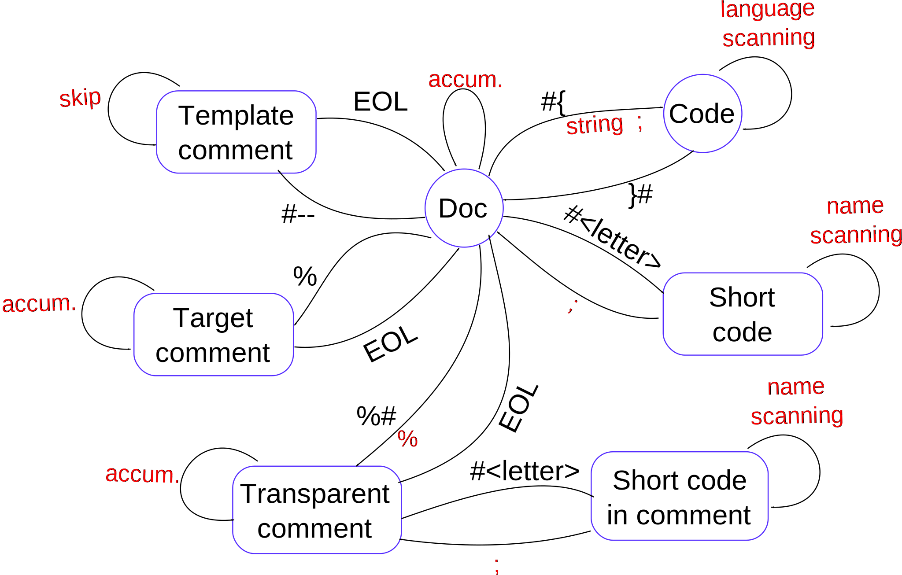

# Internal details 

## Abstract
This file is a collection of notes about the internal details of the templating engine

## Front-end scanner state machine
This is the state diagram of the front-end scanner

The front-end scanner gets in input a text and produces a sequence of tokens. Every transition not esplicitely shown in the diagram, remains in the same state. End-of-file is illegal while in Code state, in every other state it causes a transition to Doc and the end of scanning.

The output of the front-end scanner is given to the parser.

From the diagram one can see that the Doc state acts like a "central state" where every other state returns.  This suggest to implement the other states as "sub-scanners" called by the central one.

## Internal values
Values are kept internally as values of type Engine_Type.  Engine_Type is a record with discriminant that specify the actual type, the discriminant can be
* Void
* Integer
* String
* Float
* Record
* Array
* Iterator

The corresponding values are
* Void: null
* Integer, String, Float: the corresponding scalar type
* Record: a descendant of Record_Interface with two functions Set and Get to access the record fields
* Array: a descendant of Array_Interface
* Iterator:  a descendant of Iterator_Interface with a cursor and a way to get the element

All the functions in the interface use values of type Engine_Type.  For the Record_Interface the field is representet by a Name_Type that is a string with the classical ID syntax.

## Symbol table
During execution a symbol table is kept that maps names to values or function definitions.  The symbol table has a tree-like structure and at any time the last leaf is active.  A symbol is searched in the leaf first, then moving upwards to the ancestor.  A new node is added when a block is entered: if the block is a function the new node is added as descendant of the root (the root contains the global symbols), if the block is an "internal block" (e.g., in a for loop) the node is added as a descendant of current node.  When the block is exited, the node is removed and a new leaf becomes the active one.  
